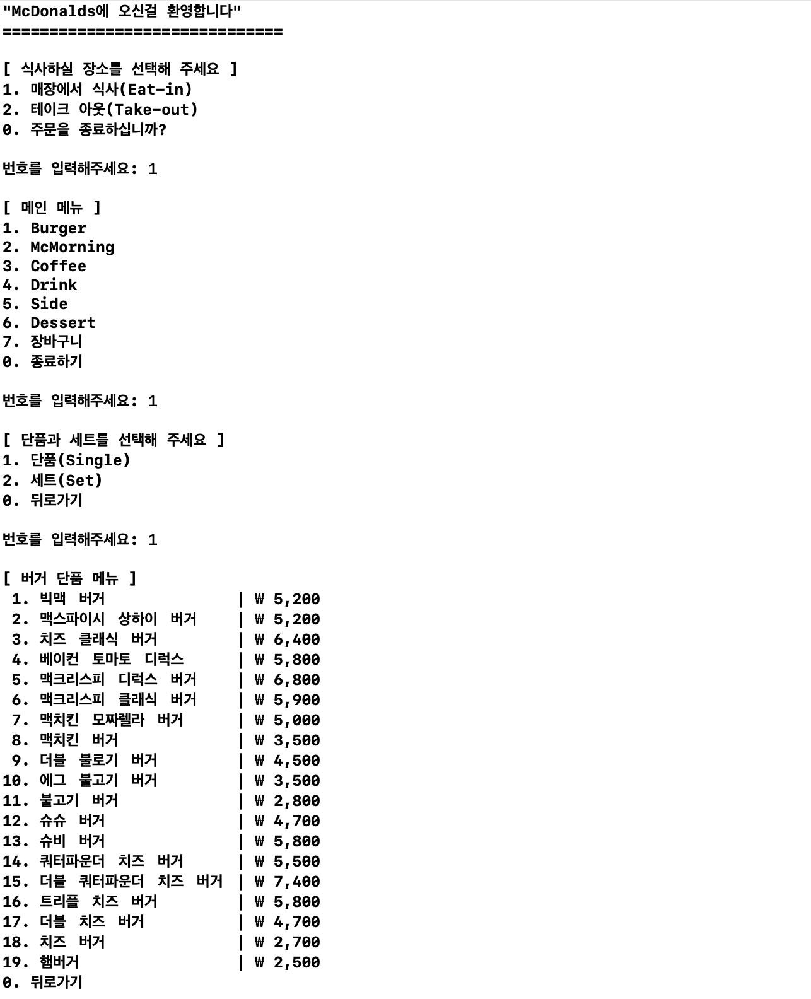
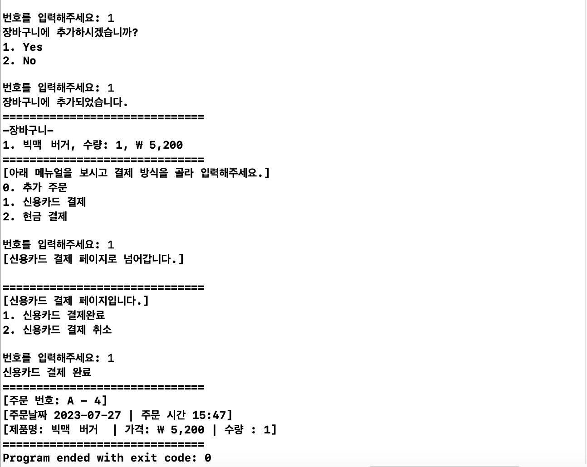

# 프로젝트 개요
1. 프로젝트명 : 맥도날드 키오스크 프로그램
2. 팀명 : 내꿈은 맥도날드
3. 프로젝트 목표: 콘솔 형태의 키오스크 구현
4. 프로젝트 기간: 2023년 07월 24일 - 2023년 07월 27일

### 팀원
* 김준우: Payment function 담당
* 이수현: Basket function 담당
* 전상혁: Order Type, Item Type 담당
* 하호형: Main Menu 담당
* 홍준영: Order Number 담당

### 실행 화면

## Keep
1. 원활한 의사소통을 통한 문제 해결
2. 자신이 짠 코드가 아니어도 적극적인 참여
3. 최대한 여러가지 방식으로 짜기 위해서 노력
4. 각자의 방식을 존중하여 코드 수정

## Problem
### 1. 깃허브 사용 미숙
`pull request` 과정에서 `conflict`가 계속 발생해서 `pull`이 제대로 이루어지지 않았던 점
>#### Solution
>1. `git clone` 으로 새로운 폴더에 해당 브랜치를 `pull` 해서 해결
>2. `git branch`를 새로 만들어서, 새로운 브랜치에서 다시 작업
>3. `git reset`을 사용하여 모두 초기화 시킨 후 `pull`을 통해서 새롭게 담음

### 2. 코드 분리의 어려움
전체 틀을 짜지 않은 상태로 각자 맡은 부분의 코드를 작성하기 시작해서, 합치는 과정에서 문제 발생. 
각자가 짠 코드에서 서로 필요한 부분이 있는데, 그것을 불러오는 것을 정해진 방식 없이 개별적으로 진행하여, 코드를 합쳤을 때 문제 발생.
>#### Solution
>클래스의 상속과 추상화를 통해 코드를 각기 분리시켜서, 값을 받아오기 편한 구조로 변경.

## Try
1. 프로젝트를 시작할 때 모두가 함께 와이어 프레임을 짜는 시간을 갖기
2. 깃허브 사용법 숙지
3. xcode툴 사용법 숙지
4. 파일 분리와 논리구조에 대하여 생각하며 코드 작성
